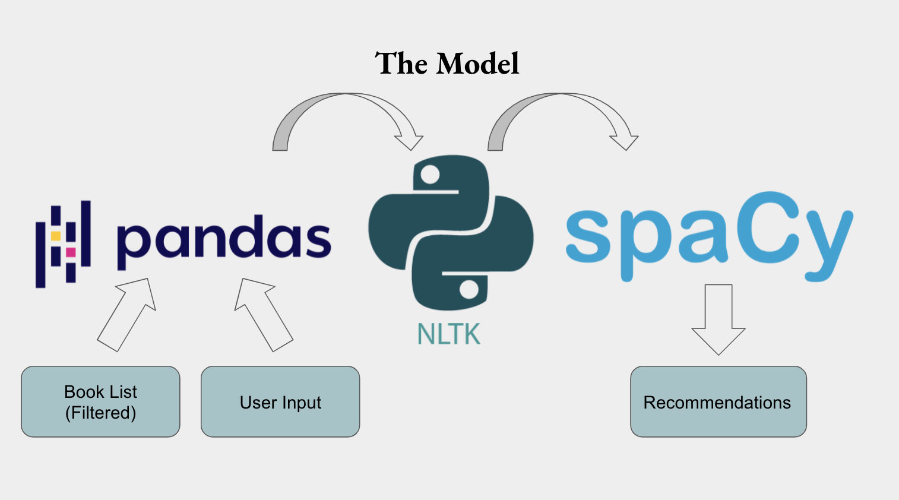

# Ligeia Reads
## A book recommender for horror fans  

The choice to read is always an investment. Whether you are buying a book or borrowing one, there's a substantial investment of time at stake.   

So it makes sense that readers often seek advice about what books they would most enjoy. My web application is named Ligeia Reads as a nod to Edgar Allan Poe's gothic tales and it caters specifically to horror fans. It uses NLP (natural language processing) to make book recommendations based on a reader's tastes.  

## The Data

## Preprocessing and EDA

## My Model

## Flask App

## Future Plans

## References and Further Reading

