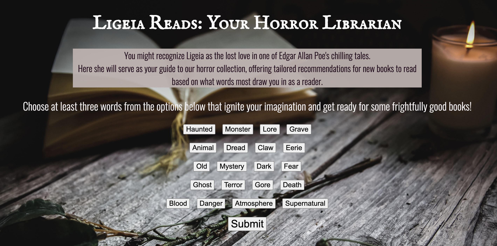
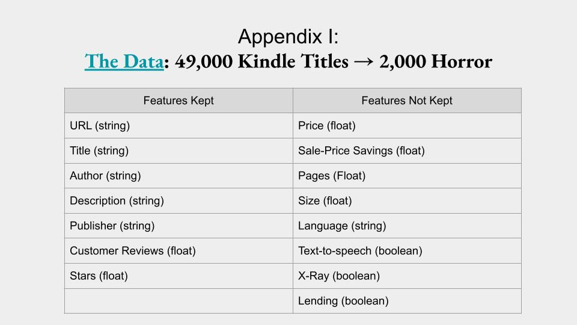
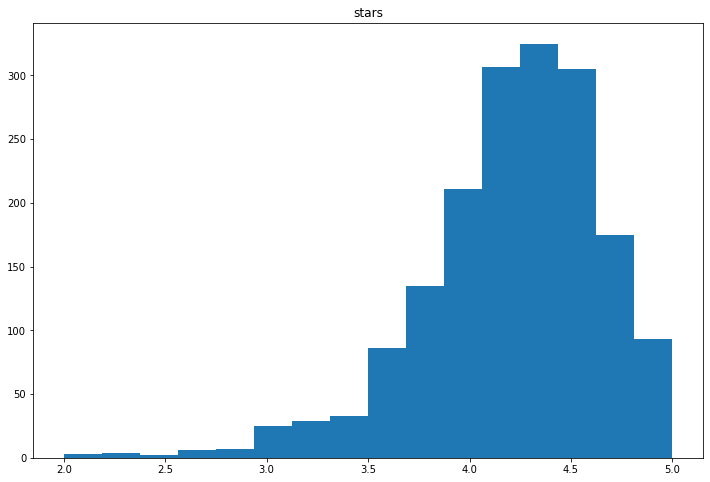
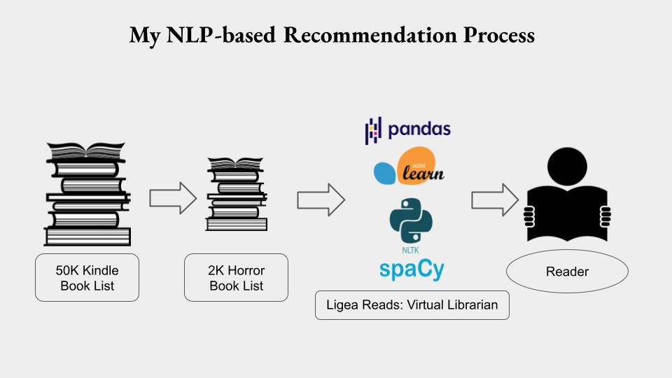

# Ligeia Reads
## A book recommender for horror fans  

[Presentation Link](https://docs.google.com/presentation/d/1Dqjpqgum1q3hSZ6z1A5bbvgXSA3sR3BplZJOtmb83g4/preview "Ligeia Reads Presentation for Capstone 3")

The choice to read is always an investment. Whether you are buying a book or borrowing one, there's a substantial investment of time at stake.   

So it makes sense that readers often seek advice about what books they would most enjoy. My web application is named Ligeia Reads as a nod to Edgar Allan Poe's gothic tales and it caters specifically to horror fans. It uses NLP (natural language processing) to make book recommendations based on a reader's tastes.  

## The Data

## Preprocessing and EDA

## My Workflow

![Ligeia details] (images/flow1.jpg)

## Flask App
 
My design goal when considering how the app would look was to decrease the feeling of friction for the reader by providing an interface that is playful and does not force readers to describe what they want, which can be more difficult than it seems. Readers often have a difficult time verbalizing the kind of book they’re looking for. Some of these words were taken from a previous project on classifying horror authors and vectorizing full-text and others I added based on my knowledge of the kinds of language used in various subgenres of horror. 

## Future Plans
 
My next steps to enhance this reader’s advisory tool would be to:  
(1) enrich the dataset with information about interest-level. Every book vendor I have worked with has that filtering option and the dataset I used was limited in that way.  
(2) I would add a freeform text-input field so readers can add ideas about the kind of books they are looking for, in their own words if they choose.  
(3)I would offer ready-to-go  read-alike suggestions for books the user has already enjoyed and that would enhance the sense of personalization and discovery. 

## References and Further Reading

